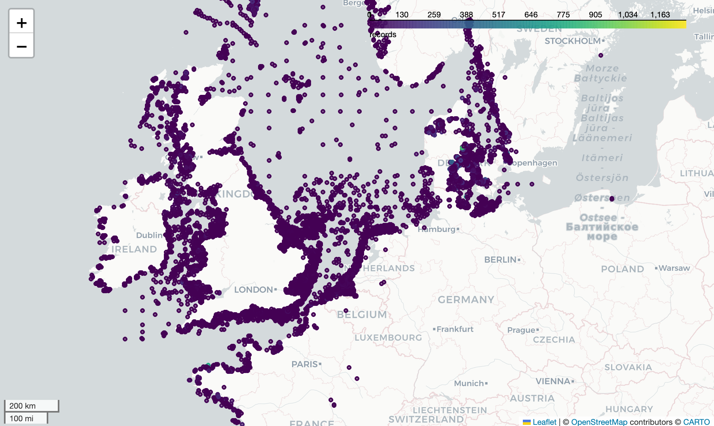
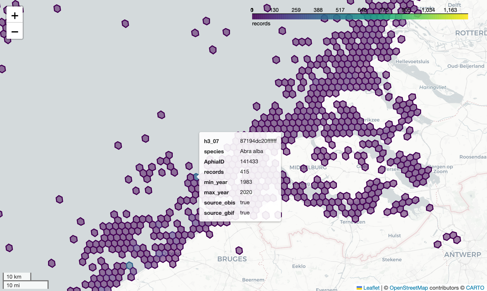

# speciesgrids

This Python package builds gridded datasets of WoRMS aligned marine species distributions as GeoParquet based on the OBIS and GBIF occurrence snapshots. The package currently supports Geohash and H3 grid output.

## Data usage
### Data access

A number of grids are available for download from S3:

```bash
aws s3 cp --recursive s3://obis-products/speciesgrids .
```

### Data exploration using geopandas

```python
import geopandas

filters = [("AphiaID", "==", 141433)]

gdf = geopandas.read_parquet("../h3_7/", filters=filters)
gdf.explore(column="records", cmap="viridis", legend=True, tiles="CartoDB positron")
```



```python
gdf.set_index("h3_07", inplace=True)
gdf = gdf.h3.h3_to_geo_boundary()
gdf.explore(column="records", cmap="viridis", legend=True, tiles="CartoDB positron")
```



### Notebooks

Other data usage examples are available as [notebooks](notebooks).

## For developers

### Data preparation

The following source datasets need to be prepared:

- OBIS occurrence snapshot
- GBIF occurrence snapshot
- WoRMS export (taxon and species profile tables)
- IUCN Red List export
- GBIF taxonomic backbone to WoRMS taxonomy from ChecklistBank

### Run

Adapt the file paths and grid configuration in `speciesgrids/__main__.py` and run:

```bash
python -m speciesgrids
```

### Upload to S3

```
aws s3 sync geohash_4 s3://obis-products/speciesgrids/geohash_4
aws s3 sync h3_7 s3://obis-products/speciesgrids/h3_7
```
