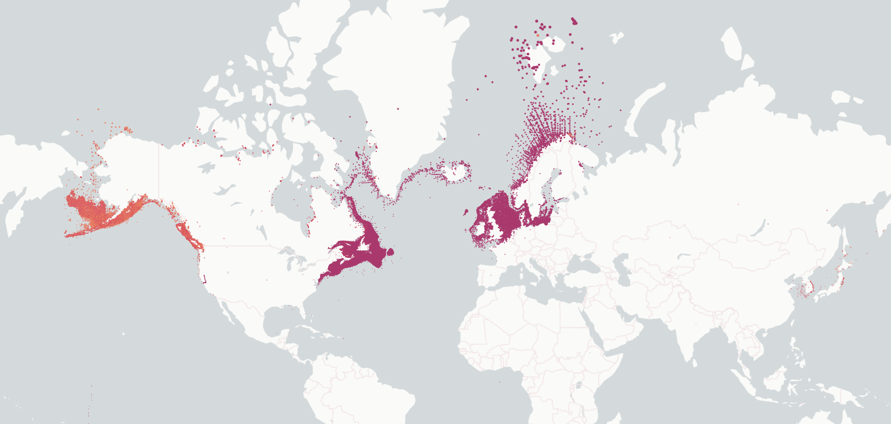

# speciesgrids

This Python package builds gridded datasets of WoRMS aligned marine species distributions as GeoParquet based on the OBIS and GBIF occurrence snapshots. The package currently supports Geohash and H3 grid output.

## Data usage
### Citing

When using this data product, please copy the citations provided below:

```
OBIS (2024). speciesgrids (version 0.1.0). https://github.com/iobis/speciesgrids
GBIF.org (1 May 2024) GBIF Occurrence Data https://doi.org/10.15468/dl.ubwn8z
OBIS (25 October 2023) OBIS Occurrence Snapshot. Ocean Biodiversity Information System. Intergovernmental Oceanographic Commission of UNESCO. https://obis.org.
World Register of Marine Species. Available from https://www.marinespecies.org at VLIZ. Accessed 2024-05-01. doi:10.14284/170.
IUCN. 2023. The IUCN Red List of Threatened Species. Version 2023-1. https://www.iucnredlist.org. Accessed on 13 May 2024.
Gearty W, Chamberlain S (2022). rredlist: IUCN Red List Client. R package version 0.7.1, https://CRAN.R-project.org/package=rredlist.
```

### Data access

A number of grids are available for download from S3:

```bash
aws s3 cp --recursive s3://obis-products/speciesgrids/h3_7 .
```

### Example: species distributions

This example uses a local copy of the dataset to explore the distribution of Gadus species.

```python
import geopandas
import lonboard
import seaborn as sns

filters = [("genus", "==", "Gadus")]
gdf = geopandas.read_parquet("../h3_7/", filters=filters)[["cell", "records", "geometry", "species"]]

def generate_colors(unique_species):
    palette = sns.color_palette("Paired", len(unique_species))
    rgb_colors = [[int(r*255), int(g*255), int(b*255)] for r, g, b in palette]
    color_map = dict(zip(unique_species, rgb_colors))
    colors = lonboard.colormap.apply_categorical_cmap(gdf["species"], color_map)
    return colors

point_layer = lonboard.ScatterplotLayer.from_geopandas(gdf)
point_layer.get_radius = 10000
point_layer.radius_max_pixels = 2
point_layer.get_fill_color = generate_colors(gdf["species"].unique())
lonboard.Map([point_layer])
```



### Example: regional species list in R

This spatially queries the GeoParquet dataset on AWS using a WKT geometry.

```r
library(duckdb)
library(DBI)
library(dplyr)
library(jsonlite)
library(glue)
library(stringr)

# Read WKT from https://wktmap.com/?e6b28728

wkt <- fromJSON("https://xpjpbiqaa3.execute-api.us-east-1.amazonaws.com/prod/wkt/e6b28728")$wkt %>% 
  str_replace("<.*?>\\s", "")

# Set up duckdb connection and extensions

con <- dbConnect(duckdb())
dbSendQuery(con, "install httpfs; load httpfs;")
dbSendQuery(con, "install spatial; load spatial;")

# Query

species <- dbGetQuery(con, glue("
  select kingdom, phylum, class, family, genus, species, AphiaID
  from read_parquet('s3://obis-products/speciesgrids/h3_7/*')
  where ST_Intersects(geometry, ST_GeomFromText('{wkt}')) 
  group by kingdom, phylum, class, family, genus, species, AphiaID
"))
```

### Speedy

This data product is used in the [speedy](https://github.com/iobis/speedy) package which combines species distribution data with WoRMS distributions, thermal envelopes, and kernel densities. Speedy in turn is used for applications such as the Pacific islands Marine bioinvasions Alert Network (PacMAN).

### Notebooks

Other data usage examples are available as [notebooks](notebooks).

## For developers

### Data preparation

The following source datasets need to be prepared:

- OBIS occurrence snapshot
- GBIF occurrence snapshot
- WoRMS export (taxon and species profile tables)
- IUCN Red List export
- GBIF taxonomic backbone to WoRMS taxonomy from ChecklistBank

### Run

Adapt the file paths and grid configuration in `speciesgrids/__main__.py` and run:

```bash
python -m speciesgrids
```

### Upload to S3

```
aws s3 sync geohash_4 s3://obis-products/speciesgrids/geohash_4
aws s3 sync h3_7 s3://obis-products/speciesgrids/h3_7
```
