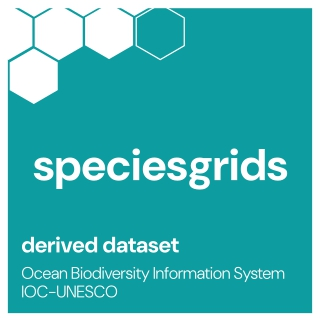
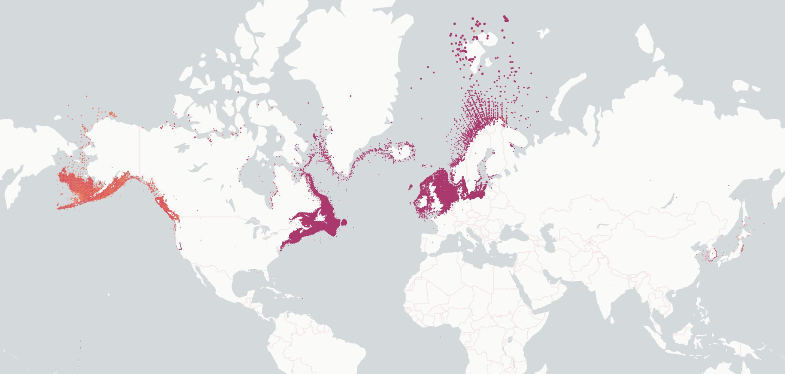

#  `speciesgrids` - cloud-optimized gridded dataset of marine species occurrence

[](https://doi.org/10.5281/zenodo.19392660)
[](https://products.obis.org/dataset/10-5281-zenodo-19392660)
[](https://www.ioc.unesco.org/en/mission-and-objectives)
[](https://colab.research.google.com/github/iobis/speciesgrids)

`speciesgrids` is a cloud-optimized gridded dataset of WoRMS-aligned marine species distributions based on OBIS occurrence data and a GBIF occurrence cube. The dataset is available as [GeoParquet](https://geoparquet.org/) on an [H3](https://h3geo.org/) grid.

This repository documents the Python package that generates the `speciesgrids` product. You can explore how to access and use this product [here](https://github.com/iobis/speciesgrids#data-access). You can also check the [notebooks](https://github.com/iobis/speciesgrids/notebooks), with examples of use in Python and R.

## Data usage
### Citing

When using this data product, please copy the citations provided below:

```
OBIS (2024). speciesgrids (version 0.2.0). Ocean Biodiversity Information System. Intergovernmental Oceanographic Commission of UNESCO. https://doi.org/10.5281/zenodo.19392660

GBIF.org (1 May 2024) GBIF Occurrence Data https://doi.org/10.15468/dl.ubwn8z

OBIS (25 October 2023) OBIS Occurrence Snapshot. Ocean Biodiversity Information System. Intergovernmental Oceanographic Commission of UNESCO. https://obis.org.

World Register of Marine Species. Available from https://www.marinespecies.org at VLIZ. Accessed 2024-05-01. doi:10.14284/170.

IUCN. 2023. The IUCN Red List of Threatened Species. Version 2023-1. https://www.iucnredlist.org. Accessed on 13 May 2024.

Gearty W, Chamberlain S (2022). rredlist: IUCN Red List Client. R package version 0.7.1, https://CRAN.R-project.org/package=rredlist.
```

### Data access

An [h3 grid](https://h3geo.org/) at [resolution 7](https://h3geo.org/docs/core-library/restable/) is available for download from S3. Resolution can easily be scaled down (i.e. cells made larger) via freely available h3 tools.

```bash
aws s3 cp --no-sign-request s3://obis-products/speciesgrids/h3_7/data.parquet .
```

### Metadata


#### File organization

The product is a single GeoParquet file (`h3_7/data.parquet`). Download it and query locally with DuckDB, GeoPandas, or any Parquet-aware tool; in cloud environments you can also query the S3 object directly.

#### Data dictionary

The parquet file contains the following columns:

| Column        | Type         | Description |
|---------------|--------------|-------------|
| `species`     | string       | Accepted scientific name at species rank, from WoRMS taxonomy. |
| `AphiaID`     | int32        | WoRMS persistent taxonomic identifier. Resolvable at `https://www.marinespecies.org/aphia.php?p=taxdetails&id={AphiaID}`. |
| `records`     | int64        | Count of underlying OBIS and GBIF occurrence records aggregated into this (cell, species) tuple. |
| `min_year`    | int64        | Earliest observation year among the aggregated records. NULL if no underlying record carries a year. |
| `max_year`    | int64        | Latest observation year among the aggregated records. NULL if no underlying record carries a year. |
| `source_obis` | boolean      | True if at least one underlying record originated from OBIS. |
| `source_gbif` | boolean      | True if at least one underlying record originated from GBIF. |
| `kingdom`     | string       | Taxonomic kingdom, from WoRMS accepted taxonomy. May be NULL where the source taxonomy is incomplete. |
| `phylum`      | string       | Taxonomic phylum, from WoRMS accepted taxonomy. |
| `class`       | string       | Taxonomic class, from WoRMS accepted taxonomy. |
| `order`       | string       | Taxonomic order, from WoRMS accepted taxonomy. |
| `family`      | string       | Taxonomic family, from WoRMS accepted taxonomy. |
| `genus`       | string       | Taxonomic genus, from WoRMS accepted taxonomy. |
| `category`    | string       | IUCN Red List threat status (only present when a redlist file is configured at build time). |
| `geometry`    | geometry     | Centroid of the H3 cell as a Point geometry in WGS 84 (EPSG:4326), encoded per the GeoParquet specification. |
| `cell`        | string       | Uber H3 cell index at resolution 7, as a 15-character hexadecimal string. |


### Example: species distributions

This example uses a local copy of the dataset to explore the distribution of Gadus species.

```python
import geopandas
import lonboard
import seaborn as sns

filters = [("genus", "==", "Gadus")]
gdf = geopandas.read_parquet("../build/h3_7/data.parquet", filters=filters)[["cell", "records", "geometry", "species"]]

def generate_colors(unique_species):
    palette = sns.color_palette("Paired", len(unique_species))
    rgb_colors = [[int(r*255), int(g*255), int(b*255)] for r, g, b in palette]
    color_map = dict(zip(unique_species, rgb_colors))
    colors = lonboard.colormap.apply_categorical_cmap(gdf["species"], color_map)
    return colors

point_layer = lonboard.ScatterplotLayer.from_geopandas(gdf)
point_layer.get_radius = 10000
point_layer.radius_max_pixels = 2
point_layer.get_fill_color = generate_colors(gdf["species"].unique())
lonboard.Map([point_layer])
```



### Example: regional species list in R

This spatially queries the GeoParquet dataset on AWS using a WKT geometry.

```r
library(duckdb)
library(DBI)
library(dplyr)
library(jsonlite)
library(glue)
library(stringr)

# Read WKT from https://wktmap.com/?e6b28728

wkt <- fromJSON("https://xpjpbiqaa3.execute-api.us-east-1.amazonaws.com/prod/wkt/e6b28728")$wkt %>% 
  str_replace("<.*?>\\s", "")

# Set up duckdb connection and extensions

con <- dbConnect(duckdb())
dbSendQuery(con, "install httpfs; load httpfs;")
dbSendQuery(con, "install spatial; load spatial;")

# Query

species <- dbGetQuery(con, glue("
  select kingdom, phylum, class, family, genus, species, AphiaID
  from read_parquet('s3://obis-products/speciesgrids/h3_7/data.parquet')
  where ST_Intersects(geometry, ST_GeomFromText('{wkt}')) 
  group by kingdom, phylum, class, family, genus, species, AphiaID
"))
```

### Speedy

This data product is used in the [speedy](https://github.com/iobis/speedy) package which combines species distribution data with WoRMS distributions, thermal envelopes, and kernel densities. Speedy in turn is used for applications such as the Pacific islands Marine bioinvasions Alert Network (PacMAN).

### Notebooks

Other data usage examples are available as [notebooks](notebooks).

## Building the dataset

### Data preparation

Prepare these **read-only** inputs (paths are configured in `speciesgrids/__main__.py`):

- OBIS occurrence parquet from AWS

```
aws s3 sync --no-sign-request s3://obis-open-data/occurrence/ /Volumes/acasis/occurrence/
```

- GBIF occurrence cube (TSV), e.g. downloaded from the GBIF occurrence cube export
- WoRMS SQLite database produced with the [`aphiasync`](https://github.com/iobis/aphiasync) package (`parsed` table)

Derived artefacts are written under a single project folder::

```
build/
  work/                 # cube cache, taxon maps, H3 aggregates, DuckDB spill
  h3_7/data.parquet     # final GeoParquet product
```

Nothing is written back to the source volume.

GBIF scientific names are matched against the WoRMS SQLite DB (canonical name lookup, synonyms resolved via `coalesce(valid_aphiaid, aphiaid)`, marine/brackish species). OBIS `aphiaid` values are remapped the same way.

### Run

```bash
pip install -r requirements.txt
python -m speciesgrids
```

The first run converts the GBIF cube TSV to Parquet under `build/work/` (slow for a multi‑ten‑GB cube) and installs DuckDB’s `h3` / `spatial` extensions if needed. Later runs reuse files in `build/work/` unless you pass `force=True` to `build()`.

### Upload to S3

```
aws s3 cp build/h3_7/data.parquet s3://obis-products/speciesgrids/h3_7/data.parquet
```

## Funding

Funded by the European Union under the Horizon Europe Programme, Grant Agreement No. 101112823 (DTO-BioFlow). Views and opinions expressed are however those of the author(s) only and do not necessarily reflect those of the European Union or the European Research Executive Agency (REA). Neither the European Union nor the granting authority can be held responsible for them.
